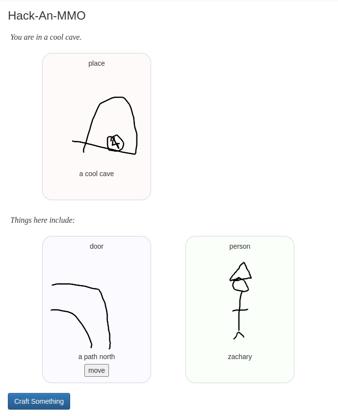

[Play Doodle RPG here](https://tilde.za3k.com/doodlerpg).

# Doodle RPG

The Doodle-verse is a universe that YOU create. It is a relaxing coloring book for everyone, all together.

## Source
Doodle RPG is open-source. You can read how it works on [github](https://github.com/za3k/doodlerpg) if you're curious. Or feel free to add new features and make it look nicer!

## Feedback
I love hearing from players. Please feel free to [email me](https://za3k.com) or use github's bug reporting feature.

### History
Doodle RPG was originally called "Hack-An-MMO". I made it during a project called [Hack-A-Day](https://za3k.com/hackaday), where I tried to make one new project a day in November. Hack-An-MMO was the final project, on Day 30.
